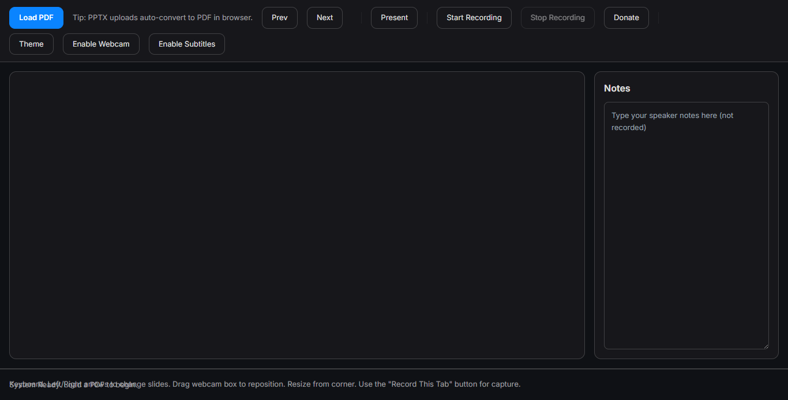

# SlideStage 🎙️📹

**SlideStage** is a privacy-focused, offline-first presentation studio that runs entirely in your browser. Record professional presentations with slides, webcam overlay, and live subtitles—no login or backend required.



## ✨ Features

- **📄 Universal File Support**: Load **PDF** files directly or drag-and-drop **PPTX** (PowerPoint) files (auto-converted locally).
- **🎥 Webcam Overlay**: Fully draggable and resizable webcam feed to keep you in the frame.
- **💬 Live Subtitles**: Real-time, privacy-friendly speech-to-text captions using the Web Speech API.
- **🔴 Browser-Based Recording**: Record your entire presentation (slides + webcam + voice) and download as MP4/WebM instantly.
- **📝 Speaker Notes**: Private notes area that isn't captured in the recording.
- **🔒 Privacy First**: Zero backend. All processing happens on your device.

## 🚀 Getting Started

### Prerequisites
- [Node.js](https://nodejs.org/) (for the local development server)

### Installation

1. **Clone the repository**
   ```bash
   git clone https://github.com/ibnkhalid06/SlideStage.git
   cd SlideStage
   ```

2. **Start the local server**
   SlideStage uses a simple custom Node.js server to handle module loading and headers.
   ```bash
   node dev-server.mjs
   ```

3. **Open in Browser**
   Navigate to `http://localhost:8080` to start using SlideStage.

## 🛠️ Tech Stack

- **Core**: Vanilla JavaScript (ES Modules)
- **Rendering**: [PDF.js](https://mozilla.github.io/pdf.js/) for slide rendering.
- **Speech**: Native Web Speech API for subtitles.
- **Recording**: `MediaRecorder` API with `getDisplayMedia`.
- **Styling**: CSS Variables & Flexbox/Grid.

## 📸 Screenshots

| Landing Page | Studio Mode |
|:---:|:---:|
|  |  |

## 🤝 Contributing

Contributions are welcome! Feel free to open an issue or submit a pull request.

## 📄 License

This project is open source.
